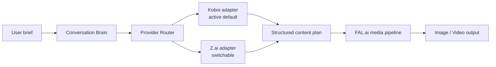

# HC Labs Prompt Compiler — Architecture

Provider choice is controlled by `LLM_PROVIDER` (`koboi` default, `zai` optional). Provider credentials are Worker secrets. The public route remains `POST /api/brain/refine`, so the frontend and license boundary remain unchanged.

## Rollback
Set `LLM_PROVIDER=zai` to return Brain traffic to Z.ai, or restore the previous commit. FAL.ai routes are untouched.

## Deployment
Backend: Cloudflare Worker connected to the GitHub `main` branch. Frontend: static repository deployment. This checkout cannot directly publish because Wrangler credentials are unavailable.
